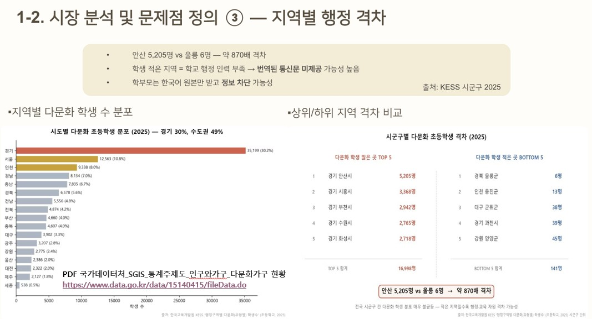

## 1-2 ③ 지역별 행정 격차 — KESS 시군구별 다문화 초등학생 분포 (2025)

> 5팀 발표자료.pdf에서 1-2. 시장 분석 및 문제점 정의 ③ - 지역별 행정 격차

---

## 설명1.: 
- 태수님이 찾은 데이터셋명: 한국교육개발원_교육통계서비스_교육통계서비스(KESS) - 출처: https://www.data.go.kr/data/15075662/fileData.do 외에 관련된 자료 및 보강할 데이터를 찾음 ↓

- PDF 국가데이터처_SGIS_통계주제도_인구와가구_다문화가구 현황
https://www.data.go.kr/data/15140415/fileData.do

## 설명2.:
> 5팀 발표자료.pdf에서 1-2. 시장 분석 및 문제점 정의 ③ - 지역별 행정 격차
관련 자료 및 보완할 자료 데이터 찾음.(15개 데이터셋 중 11개 데이터셋 활용할 수 있음.) 

- 11개 데이터셋 선별 이유: 공공데이터포털 검색창에 '다문화' 입력시 총 271건이 검색. 검색된 모든 데이터셋을 하나씩 수동으로 총 2번 조회한 결과, '5팀 발표자료.pdf에서 1-2. 시장 분석 및 문제점 정의 ③ - 지역별 행정 격차 중 지역별 다문화 학생 수 분포' 에서 경기, 서울, 인천, 경남, 충남, 경북 등 상위 막대 그래프 자료들은 많이 존재했으나 세종, 제주, 대전 등 하위 지역별은 자료가 많이 존재 하지 않았음. 상위 막대 그래프 중 경기, 서울, 인천 데이터셋을 선별하고 하위 막대 그래프 중 제주 데이터셋 선별했음. 추가적으로, 시군구별 다문화 초등학생 격차(2025) 다문화 학생 적은 곳 BOTTOM 5 자료를 보면 경북, 강원 데이터셋이 공공데이터 포털에 있어 SchoolBridge에 활용할 수 있는 데이터인지 검증했음. 15개 데이터셋 외에도 추가적으로 더 검증할 부분이 남아 있음. 이건 나중에 할거임.

1. XLS 서울특별시_다문화가구 및 가구원(구별) 통계
https://www.data.go.kr/data/15071860/fileData.do

C:\Users\kysop\Team_Project_Multiculture\multicultural-ai\model\classification\Business_Plan\By_region\다문화가구+및+가구원(구별)_20260524195505.csv

2. 서울특별시_다문화가정 학생 현황 통계
https://www.data.go.kr/data/15046284/fileData.do

C:\Users\kysop\Team_Project_Multiculture\multicultural-ai\model\classification\Business_Plan\By_region\다문화가정+학생+현황_20260524195948.csv

3. 서울특별시_다문화가족 현황 통계
https://www.data.go.kr/data/15046286/fileData.do

C:\Users\kysop\Team_Project_Multiculture\multicultural-ai\model\classification\Business_Plan\By_region\다문화가구원+현황_20260524200222.csv

4. HWP 서울특별시_외국인과의 혼인
https://www.data.go.kr/data/15046318/fileData.do

C:\Users\kysop\Team_Project_Multiculture\multicultural-ai\model\classification\Business_Plan\By_region\외국인과의+혼인(국적별_혼인종류별)_20260524200634.csv

5. 경기도교육청_다문화학생현황_학제별_행정구역별_국가별
https://www.data.go.kr/data/15077326/fileData.do

C:\Users\kysop\Team_Project_Multiculture\multicultural-ai\model\classification\Business_Plan\By_region\경기도교육청_다문화학생현황_학제별_행정구역별_국가별_20250401.xlsx

6. 경기도 안산시_내국인 및 외국인 현황
https://www.data.go.kr/data/3069669/fileData.do

C:\Users\kysop\Team_Project_Multiculture\multicultural-ai\model\classification\Business_Plan\By_region\경기도 안산시_내국인 및 외국인 현황_20260220.csv

7. 인천광역시_외국인 국적별 등록 현황
https://www.data.go.kr/data/15137051/fileData.do

C:\Users\kysop\Team_Project_Multiculture\multicultural-ai\model\classification\Business_Plan\By_region\인천광역시_외국인 국적별 등록 현황_20111231.csv

8. CSV 인천광역시_외국인 국적별 등록현황
https://www.data.go.kr/data/15055021/fileData.do

C:\Users\kysop\Team_Project_Multiculture\multicultural-ai\model\classification\Business_Plan\By_region\인천광역시_외국인 국적별 등록현황_20231231.csv

9. CSV 인천광역시_다문화 가족 통계
https://www.data.go.kr/data/15105922/fileData.do

C:\Users\kysop\Team_Project_Multiculture\multicultural-ai\model\classification\Business_Plan\By_region\인천광역시_다문화 가족 통계_20231101.csv

10. CSV 제주특별자치도_다문화가구현황
https://www.data.go.kr/data/15011595/fileData.do

C:\Users\kysop\Team_Project_Multiculture\multicultural-ai\model\classification\Business_Plan\By_region\제주특별자치도_다문화가구현황_20231231.csv

11. CSV 제주특별자치도_다문화 가구 및 가구원 현황
https://www.data.go.kr/data/15096890/fileData.do

C:\Users\kysop\Team_Project_Multiculture\multicultural-ai\model\classification\Business_Plan\By_region\제주특별자치도_다문화 가구 및 가구원 현황_20201231.csv

12. CSV 제주특별자치도_한국 국적 취득자 수 정보
https://www.data.go.kr/data/15096848/fileData.do

C:\Users\kysop\Team_Project_Multiculture\multicultural-ai\model\classification\Business_Plan\By_region\제주특별자치도_한국 국적 취득자 수 정보_20191231.csv

13. CSV 경상북도_구미시_외국인현황
https://www.data.go.kr/data/3071366/fileData.do

C:\Users\kysop\Team_Project_Multiculture\multicultural-ai\model\classification\Business_Plan\By_region\경상북도_구미시_외국인현황_20260331.csv

14. 경상북도 경주시_다문화가족 현황
https://www.data.go.kr/data/15104053/fileData.do

C:\Users\kysop\Team_Project_Multiculture\multicultural-ai\model\classification\Business_Plan\By_region\경상북도 경주시_다문화가족 현황_20230822.csv

15. CSV 강원특별자치도_주요국적별 외국인 등록현황 통계
https://www.data.go.kr/data/15050501/fileData.do#

C:\Users\kysop\Team_Project_Multiculture\multicultural-ai\model\classification\Business_Plan\By_region\외국인_국적별_현황_20260524201426.csv

## 그 외 오픈 API — 탐색 결과 및 결론

### 1. XML JSON 성평등가족부_전국다문화가족실태조사 마이크로데이터 정보 서비스
https://www.data.go.kr/data/15078202/openapi.do

- End Point: `https://apis.data.go.kr/1383000/stis/srvyMltCltrFmlyMcrDataService`
- 제공 기능: `getServeyMulticulturalFamliyTargetList` (조사 대상 목록) → `getServeyMulticulturalFamliyDataList` (마이크로데이터)

**실제 API 호출 탐색 결과 (인증키로 직접 확인)**

| 조사연도 | 데이터 유무 | 비고 |
|----------|-------------|------|
| 2024 | ❌ 없음 | |
| 2023 | ❌ 없음 | |
| 2022 | ❌ 없음 | |
| 2021 | ❌ 없음 | 3년 주기 조사인데도 API 미등록 |
| 2020 | ❌ 없음 | |
| 2019 | ❌ 없음 | |
| **2018** | ✅ 57,739건 | 최신 — 등록일 2021-03-22 |
| 2015 | ✅ 존재 | |
| 2012 | ✅ 존재 | |

**결론: SchoolBridge에 불필요**
- 최신 데이터가 2018년에 멈춰 있고, 2021·2024년 조사 결과는 API에 올라오지 않음
- 발표자료에 인용된 여가부 2024 수치(읽기 3.82, 쓰기 3.68, 학부모 모임 비참여 71.6%)는 이 API가 아니라 여가부 PDF 보고서에서 직접 가져온 것이므로 API 없이도 동일하게 인용 가능

---

### 2. 연계데이터 — 지역별 다문화 가족 분포 정보
https://www.data.go.kr/data/844871/linkedData.do  
실제 데이터 위치: https://www.bigdata-culture.kr (한국청소년활동진흥원 KYWA)

**탐색 결과**
- 제공 데이터: 2019년, 2020년 두 해뿐
- 상태: "센터와 협의가 종료된 상태로 상품 업데이트 및 상담이 불가" → 사실상 폐기

**결론: SchoolBridge에 불필요**
- By_region/ 폴더에 이미 2023~2026년 최신 CSV(11개 데이터셋)가 있어 완전히 대체 가능
- 더 오래되고 업데이트도 안 되는 데이터를 추가할 이유 없음

## Maybe폴더: SchoolBridge가 활용할 수 있는 데이터인지 정확한 확인 필요. --> 안 할 거임.
C:\Users\kysop\Team_Project_Multiculture\multicultural-ai\model\classification\Business_Plan\Maybe

1. CSV 한국건강가정진흥원_전국 다문화가족지원센터 통번역 지원사 배치현황
https://www.data.go.kr/data/3081602/fileData.do

2. ODT 한국언론진흥재단_뉴스빅데이터_메타데이터_다문화https://www.data.go.kr/data/15089699/fileData.do
