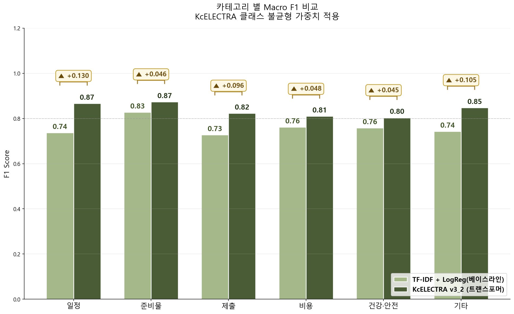
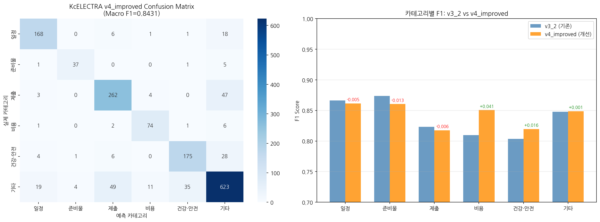

# SchoolBridge — 가정통신문 문장 분류 모델

> 다문화 가정 학부모를 위한 가정통신문 AI 도우미의 **자연어처리(NLP) 분류 파트**

한국어가 서툰 다문화 가정 학부모에게 가정통신문은 큰 장벽입니다. SchoolBridge는 가정통신문을 문장 단위로 쪼개어 **"무엇을 해야 하는지"를 6개 카테고리로 자동 분류**하고, 학부모가 놓치면 안 되는 정보를 골라내는 서비스입니다. 이 저장소는 그중 **문장 분류 모델**을 다룹니다.

```
가정통신문 이미지 → [문장 추출] → ★[카테고리 분류]★ → [번역·요약] → 학부모
                                    이 저장소
```

---

## 핵심 성과

| | |
|---|---|
| **Macro F1 0.8431** | KcELECTRA 파인튜닝 최종 성능 (6-class) |
| **베이스라인 대비 +10.6%** | TF-IDF + Logistic Regression(0.7625) 대비 상대 향상 |
| **16,512행** | Claude API 자동 라벨링으로 구축·검수한 학습 데이터셋 |
| **HuggingFace Hub 배포** | FastAPI 백엔드 연동 완료 |

딥러닝 도입의 당위성을 수치로 입증하기 위해, **가볍고 저렴한 전통 ML 베이스라인을 동일 조건에서 함께 학습시켜 비교**하는 방식으로 설계했습니다.

---

## 6개 카테고리

가정통신문에서 학부모의 **행동이 필요한 정보**를 기준으로 분류 체계를 설계했습니다.

| 카테고리 | 설명 | 예시 |
|---|---|---|
| `일정` | 날짜·시간이 걸린 정보 | "3월 15일 학부모 총회가 있습니다" |
| `준비물` | 챙겨 보내야 할 물건 | "체육복과 실내화를 준비해 주세요" |
| `제출` | 회신·서명이 필요한 항목 | "동의서를 3일까지 제출해 주십시오" |
| `비용` | 납부해야 할 금액 | "현장학습비 15,000원을 납부합니다" |
| `건강·안전` | 건강·안전 관련 안내 | "발열 시 등교를 자제해 주세요" |
| `기타` | 위에 해당하지 않는 일반 안내 | "교육 과정 운영에 협조 바랍니다" |

---

## 성능 비교

세 모델 모두 **완전히 동일한 test set 1,593건**으로 평가했습니다.

### 메인 비교 — 왜 트랜스포머를 써야 하는가

| 모델 | 학습 데이터 | Macro F1 | Precision | Recall |
|---|---|---|---|---|
| Simple (TF-IDF + LogReg) | split_v4 train 13,210행 | 0.7625 | 0.7389 | 0.7984 |
| **KcELECTRA v4_improved** | split_v4 train 13,210행 | **0.8431** | 0.8408 | 0.8459 |
| | | **+0.0806 (+10.6%)** | | |

두 모델이 **같은 데이터로 학습하고 같은 문제를 풀었기 때문에**, 이 격차는 온전히 모델 아키텍처의 차이입니다.

### 카테고리별 F1

| 카테고리 | 샘플 수 | Simple | KcELECTRA v4_improved | 차이 |
|---|---|---|---|---|
| 일정 | 194 | 0.7395 | **0.8615** | +0.1220 |
| 준비물 | 44 | 0.8276 | **0.8605** | +0.0329 |
| 제출 | 316 | 0.7289 | **0.8175** | +0.0886 |
| 비용 | 84 | 0.7784 | **0.8506** | +0.0722 |
| 건강·안전 | 214 | 0.7500 | **0.8197** | +0.0697 |
| 기타 | 741 | 0.7508 | **0.8488** | +0.0980 |

**6개 카테고리 전부에서** 베이스라인을 앞섭니다. 특정 클래스만 잘 맞혀서 평균이 올라간 것이 아니라는 근거입니다.



---

## 실험 이력

성능을 한 번에 얻은 것이 아니라, 가설 → 실험 → 검증을 반복했습니다.

| 버전 | 핵심 변경 | Macro F1 |
|---|---|---|
| v1_2 | KcELECTRA 파인튜닝 기반 구축 | — |
| v2_2 | 데이터 정제·재라벨링 | — |
| v3 | 학습 데이터 확장 | — |
| v3_2 | **클래스 불균형 보정 가중 손실함수 적용** | 0.8374 |
| v4 | 학교알리미 공공데이터 564행 증강 | 0.8365 ⚠️ |
| **v4_improved** | v4 실패 원인 교정 + 학습 기법 개선 | **0.8431** |

**v4에서 성능이 떨어진 이유**와 그 교정 과정이 이 프로젝트에서 가장 중요한 지점입니다.

증강 데이터가 train뿐 아니라 **validation set에도 섞여 들어가** 검증 점수가 실제 성능을 반영하지 못했습니다. v4_improved에서는 val/test를 원본 데이터로만 명시적으로 필터링했습니다.

```python
train_df = df[df['split'] == 'train']                                  # 13,210 (원본 + 증강)
val_df   = df[(df['split'] == 'val')  & (df['source'] == 'original')]  # 1,596 (원본만)
test_df  = df[(df['split'] == 'test') & (df['source'] == 'original')]  # 1,593 (원본만)
```

여기에 Label Smoothing과 cosine learning rate schedule을 더해 0.8365 → **0.8431**로 회복·향상시켰습니다.



> 비교 설계의 공정성 근거는 [docs/comparison_design_v4_improved_20260526.md](docs/comparison_design_v4_improved_20260526.md)에 정리했습니다.

---

## 데이터셋 구축

공개된 가정통신문 라벨 데이터가 없어 **직접 구축**했습니다.

- **Claude API 자동 라벨링** — 수작업으로는 불가능한 규모를 LLM으로 1차 라벨링 후 검수 ([scripts/auto_label_from_new_data_20260504.py](scripts/auto_label_from_new_data_20260504.py))
- **교육부 학교알리미 공공데이터 증강** — 소수 클래스(`건강·안전` +152, `일정` +237, `비용` +62) 보강
- **최종 16,512행** — train 13,210 / val 1,596 / test 1,593

`기타`가 741건인 반면 `준비물`은 44건으로 **클래스 불균형이 17배**에 달해, 평가 지표로 단순 정확도가 아닌 **Macro F1**을 사용하고 학습에 가중 손실함수를 적용했습니다.

---

## 프로젝트 구조

```
├── src/                  # 백엔드 연동용 추론 모듈
│   ├── predict.py            # 진입점 — predict_one()
│   ├── classifier_kcelectra.py
│   └── classifier_simple.py
├── notebooks/            # 학습·시각화 (Google Colab GPU)
├── scripts/              # 데이터 분할·평가·자동 라벨링·HF 업로드
├── data/                 # 데이터셋 및 날짜별 평가 결과
├── checkpoints/          # config·tokenizer·성능 그래프 *
├── docs/                 # 실험 설계 문서 및 개발 로그
└── Business_Plan/        # 국가통계 기반 시장 분석
```

\* 모델 가중치(`.safetensors`)는 GitHub 100MB 제한으로 제외되어 HuggingFace Hub에 있습니다.

---

## 사용법

```bash
pip install torch transformers scikit-learn pandas
```

```python
from src.predict import predict_one

result = predict_one("체육복과 실내화를 준비해 주세요", model="kcelectra")
# {'text': '체육복과 실내화를 준비해 주세요',
#  'category': '준비물',
#  'confidence': 0.94,
#  'model_used': 'kcelectra'}
```

`model` 인자는 `"kcelectra"`(고성능), `"simple"`(경량·CPU), `"auto"`(체크포인트 있으면 KcELECTRA, 없으면 simple로 폴백)를 지원합니다.

**배포 모델:** [huggingface.co/kysophia/kcelectra-category](https://huggingface.co/kysophia/kcelectra-category) — subfolder `kcelectra-category-v3_2` (Macro F1 0.8374)

---

## 기술 스택

`KcELECTRA(beomi/kcelectra-base)` · `HuggingFace Transformers` · `PyTorch` · `scikit-learn(TF-IDF·Logistic Regression)` · `Claude API` · `pandas` · `matplotlib`·`seaborn` · `HuggingFace Hub` · `FastAPI` · `Google Colab`

---

## 담당 역할

SchoolBridge 팀 프로젝트에서 **NLP·LLM 파트**를 담당했습니다.

- 6개 카테고리 다중분류 모델 개발 및 v1→v4 반복 실험
- Claude API 자동 라벨링 기반 학습 데이터 약 16,000행 구축·검수
- 베이스라인 대비 성능 우위 입증을 위한 비교 실험 설계 및 시각화
- HuggingFace Hub 배포 및 FastAPI 백엔드 연동
- 최종 팀 발표

원본 팀 저장소: [Maxmunzy/multicultural-ai](https://github.com/Maxmunzy/multicultural-ai)

---

## 참고 문서

- [README5.md](README5.md) — 분류 과제 정의 및 베이스라인 비교 요구사항
- [README6.md](README6.md) — 두 가지 베이스라인의 목적 구분
- [docs/](docs/) — 실험 설계 문서 및 날짜별 개발 로그
